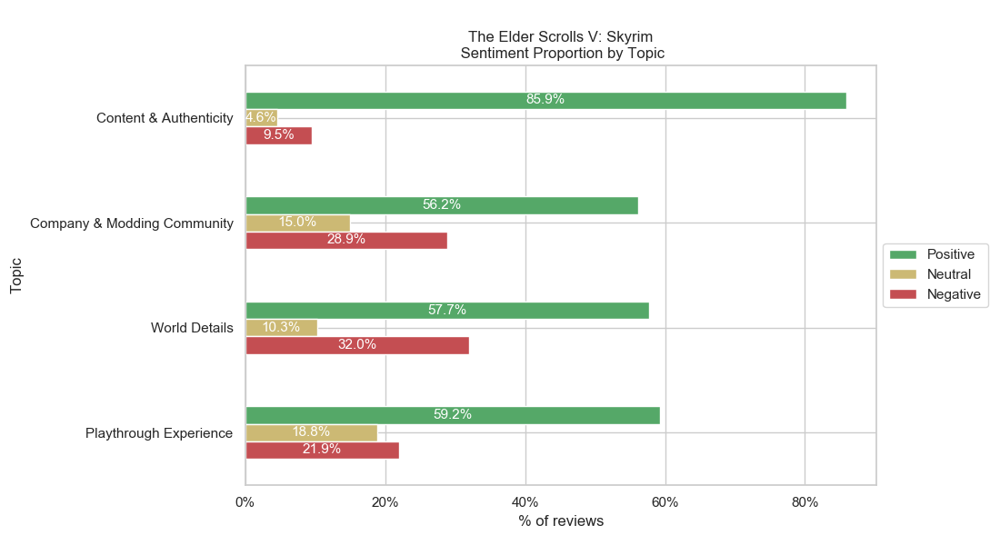
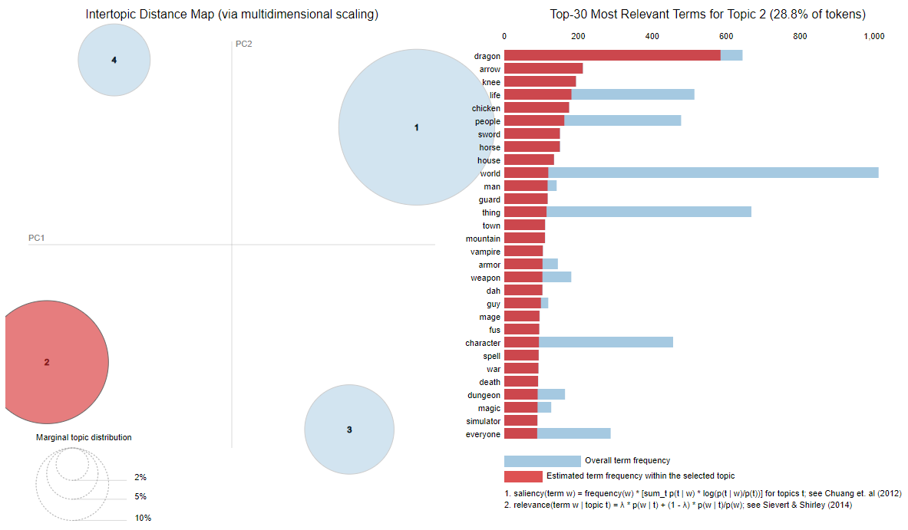

# Steam Data Mining Project
A content-based recommender system and review analysis of 'The Elder Scrolls V: Skyrim' for my MSc course 'Data mining'. Sentiment analysis inspired by [SteamVox](https://medium.com/@talietzin/steamvox-topic-modelling-sentiment-analysis-d83a88d3003a#:~:text=SteamVox%20scrapes%2C%20cleans%2C%20and%20analyses,of%20positivity%20to%20celebrate!).

### Example figures

